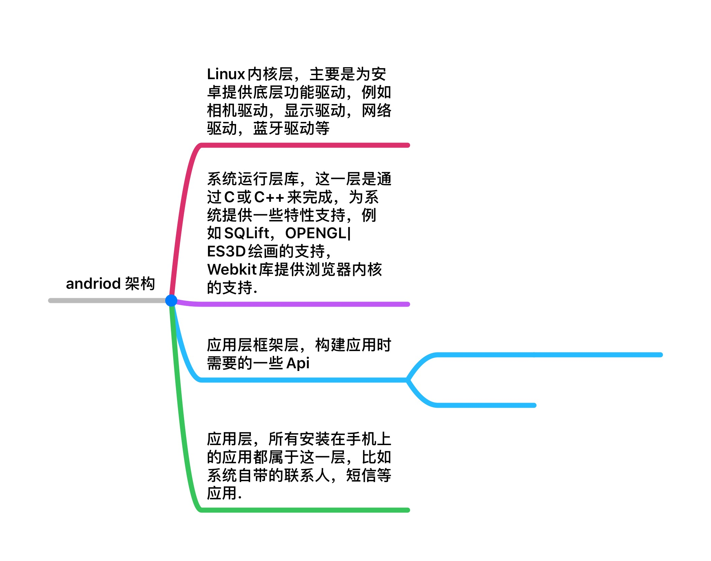
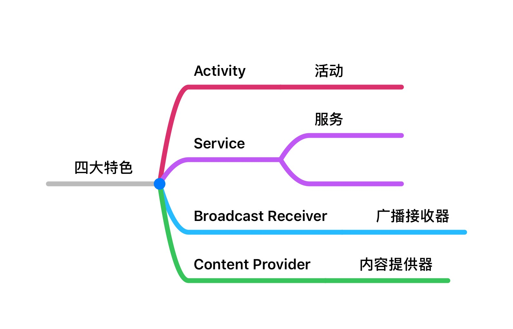

## 安卓架构

## 安卓特色

### 4大组件



**Activity** 安卓应用的门面，凡是在安卓应用中看到的都是放在Activity中的，可以理解为前端的页面.

**Service** 它比较低调，看不见，运行在后台，即使用户退出应用，它任然可以继续运行.

**Broadcast Receiver** 广播接收器允许你的应用接受各处来的消息，比如电话，短信等，当然同样也允许往外广播消息.

**Content Provider** 内容提供器是为应用程序之间共享数据提供了可能，比如要读取电话薄中联系人，就需要用到内容提供器.

总结:

*   Activity
    >   作为呈现给用户的界面
*   Service
    >   服务于应用程序的
*   Broadcast Receiver
    >   用于内部Activity之间的通信
*   Content Provider
    >   用于应用之间的通信.

### 丰富的系统控件

Android为开发者提供了很多控件，可以很快开发出漂亮的界面，如果不满足，也可以通过自定义的方式来完成.

### SQLite
Android系统自带了这种轻量级的，运行速度极快的嵌入式的关系型数据库. 它不仅支持标准的SQL语法，还可以通过Android封装好的Api进行访问，让存储和读取数据变得非常方便.

### 强大的多媒体功能
例如音乐，视频，录音，闹钟，拍照等
这一切你都可以在应用中通过代码控制，这让应用更加丰富多彩.

### 地理位置定位
这是与PC端的一个很大的区别，现在Android设备都自带了GPS，所以可以利用这一特性去做很多事情.