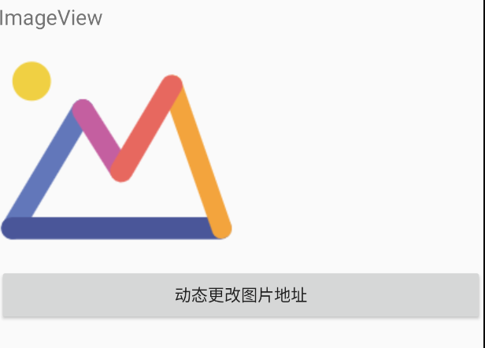
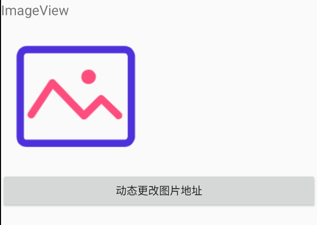

# 学习基本的控件

在开发一个应用时,掌握这些基本的控件，帮助我们快速去开发一个应用

## [TextView](https://developer.android.google.cn/guide/topics/ui/look-and-feel/autosizing-textview)

> 主要显示文本的

## [Button](https://developer.android.google.cn/guide/topics/ui/controls/button)

按钮包括几种类型 （文字 、 图片按钮、文字+图片按钮）

* 文字
``` xml
    <!--文字-->
    <Button
        android:layout_width="match_parent"
        android:layout_height="wrap_content"
        android:text="按钮"
    />

```
* ICON按钮
``` xml
    <!--图片-->
    <ImageButton
        android:layout_width="match_parent"
        android:layout_height="wrap_content"
        android:src="@mipmap/ic_launcher"
        />

```

* 文字和图片
``` xml
    <!--图文-->
    <Button
        android:layout_width="wrap_content"
        android:layout_height="wrap_content"
        android:drawableLeft="@mipmap/ic_launcher"
        android:text="图文"
        />
```

### 给按钮绑定事件的几种方式

* 内联方式(借用WEB端中描述词)

``` xml

    <Button
        android:layout_width="wrap_content"
        android:layout_height="wrap_content"
        android:drawableLeft="@mipmap/ic_launcher"
        android:text="图文"
        android:onClick="handleClick"
        />

```

``` java
    public void handleClick(View v) {
        Toast.makeText(this, "按钮被点击", Toast.LENGTH_SHORT).show();
    }

```

* 匿名方式, 在 Activity 中进行事件绑定, 这里我们需要为按钮提供一个唯一表示 id

``` xml

    <!--图文-->
    <Button
        android:id="@+id/button_01"
        android:layout_width="wrap_content"
        android:layout_height="wrap_content"
        android:drawableLeft="@mipmap/ic_launcher"
        android:text="图文"
        />

```

``` java

    @Override
    protected void onCreate(Bundle savedInstanceState) {
        super.onCreate(savedInstanceState);
        setContentView(R.layout.activity_main);

        Button  btn_01 = (Button) findViewById(R.id.button_01);
        btn_01.setOnClickListener(new View.OnClickListener(){

            @Override
            public void onClick(View e) {
                Toast.makeText(MainActivity.this, "按钮被点击", Toast.LENGTH_SHORT).show();
            }
        });
    }

```

* 实现 OnClickListener 接口的方式

``` java

   @Override
    protected void onCreate(Bundle savedInstanceState) {
        super.onCreate(savedInstanceState);
        setContentView(R.layout.activity_main);

        Button  btn_01 = (Button) findViewById(R.id.button_01);
        btn_01.setOnClickListener(this);
    }

    public void onClick(View v) {
        Toast.makeText(MainActivity.this, "按钮被点击", Toast.LENGTH_SHORT).show();
    }

```

肯定有人会问，如果通过实现接口的方式，那么要是一个页面上有多个按钮怎么办？ 很简单只需要在 ``onClick``中根据 ``View``进行区分就好

``` java

   @Override
    protected void onCreate(Bundle savedInstanceState) {
        super.onCreate(savedInstanceState);
        setContentView(R.layout.activity_main);

        Button  btn_01 = (Button) findViewById(R.id.button_01);
        btn_01.setOnClickListener(this);
    }

    public void onClick(View v) {
        switch (v.getId()){
            case R.id.button_01 :
                Toast.makeText(MainActivity.this, "按钮被点击", Toast.LENGTH_SHORT).show();
                break;
            case ....:
                // 逻辑
                break;
            default:
        }
    }

```

上述三种方式都是可行的,一般推荐使用后两者.

**注意事项**

细心🙆发现了, 事件的处理程序（方法）必须满足3个条件：

* public
* void
* 必须包含一个形参， 类型为 View

``` java

    public void onClick(View v){}

```

如果用第一种方式, 事件处理程序的方法名可以随便写的, 后两者不行🙅‍♂️.


## [EditText]()
> EditText是程序用于和用户进行交互的另一个重要控件，它允许用户在控件里输入和编辑内容，并可以在程序中对这些内容进行处理（可以理解为WEB端的 Input 标签）

``` xml

    <!--输入框-->
    <EditText
        android:id="@+id/textEdit_02"
        android:layout_width="match_parent"
        android:layout_height="wrap_content"
        android:maxLines="2"
        android:hint="请输入聊天内容"
        />
    <Button
        android:id="@+id/button_02"
        android:layout_width="match_parent"
        android:layout_height="wrap_content"
        android:text="获取聊天内容"
        />
```

``` java
    private EditText textEdit;
    @Override
    protected void onCreate(Bundle savedInstanceState) {
        super.onCreate(savedInstanceState);
        setContentView(R.layout.activity_main);

        Button  btn_01 = (Button) findViewById(R.id.button_01);
        btn_01.setOnClickListener(new View.OnClickListener(){
            @Override
            public void onClick(View e) {
                Toast.makeText(MainActivity.this, "按钮被点击", Toast.LENGTH_SHORT).show();
            }
        });
        btn_01.setOnClickListener(this);

        // 获取聊天内容
        Button  btn_02 = (Button) findViewById(R.id.button_02);
        btn_02.setOnClickListener(this);
    }
    public void handleClick(View v) {
        Toast.makeText(this, "按钮被点击", Toast.LENGTH_SHORT).show();
    }

    public void onClick(View v) {
        switch (v.getId()){
            case R.id.button_01 :
                Toast.makeText(MainActivity.this, "按钮被点击", Toast.LENGTH_SHORT).show();
                break;
            case R.id.button_02 :
                textEdit = (EditText) findViewById(R.id.textEdit_02);
                Toast.makeText(this, textEdit.getText().toString(), Toast.LENGTH_SHORT).show();
                break;
            default:
        }
    }

```

## ImageView

> 主要用来显示图片 （类似WEB端的 Image 标签）

下面准备图片(img 、img_02) , 通过一个按钮来实现动态切换， 代码如下：

``` xml

      <!--显示图片-->
    <TextView
        android:layout_width="wrap_content"
        android:layout_height="wrap_content"
        android:text="ImageView"
        android:textSize="18dp"
        />
    <ImageView
        android:id="@+id/imageView"
        android:layout_width="wrap_content"
        android:layout_height="wrap_content"
        android:src="@drawable/img"
        />
    <Button
        android:id="@+id/button_03"
        android:layout_width="match_parent"
        android:layout_height="wrap_content"
        android:text="动态更改图片地址"
        />

```

``` java

    private EditText textEdit;
    private ImageView imageView;
    @Override
    protected void onCreate(Bundle savedInstanceState) {
        super.onCreate(savedInstanceState);
        setContentView(R.layout.activity_main);

        Button  btn_01 = (Button) findViewById(R.id.button_01);
        btn_01.setOnClickListener(new View.OnClickListener(){
            @Override
            public void onClick(View e) {
                Toast.makeText(MainActivity.this, "按钮被点击", Toast.LENGTH_SHORT).show();
            }
        });
        btn_01.setOnClickListener(this);

        // 获取EditText
        textEdit = (EditText) findViewById(R.id.textEdit_02);
        // 获取ImageView
        imageView = (ImageView) findViewById(R.id.imageView);
        // 获取聊天内容
        Button  btn_02 = (Button) findViewById(R.id.button_02);
        btn_02.setOnClickListener(this);

        // 动态更改图片地址
        Button button_03 = (Button) findViewById(R.id.button_03);
        button_03.setOnClickListener(this);

    }
    public void handleClick(View v) {
        Toast.makeText(this, "按钮被点击", Toast.LENGTH_SHORT).show();
    }

    public void onClick(View v) {
        switch (v.getId()){
            case R.id.button_01 :
                Toast.makeText(MainActivity.this, "按钮被点击", Toast.LENGTH_SHORT).show();
                break;
            case R.id.button_02 :
                Toast.makeText(this, textEdit.getText().toString(), Toast.LENGTH_SHORT).show();
                break;
            case R.id.button_03 :
                imageView.setImageResource(R.drawable.img_02);
                break;
            default:
        }
    }

```





## ProgressBar

一般用来表示程序正在加载数据，这对于耗时的任务来说特别重要，👇看看基本的使用

``` xml

   <ProgressBar
        android:id="@+id/progress_bar"
        android:layout_width="wrap_content"
        android:layout_height="wrap_content"
        android:layout_gravity="center"
        android:visibility="invisible"
        />
    <Button
        android:id="@+id/button_04"
        android:layout_width="match_parent"
        android:layout_height="wrap_content"
        android:text="切换Loading动态"
        />
```

``` java

    public void onClick(View v) {
        switch (v.getId()){
            case R.id.button_04:
                if(progressBar.getVisibility() == View.GONE) {
                progressBar.setVisibility(View.VISIBLE);
            }else {
                progressBar.setVisibility(View.GONE);
            }
            default:
        }
    }

```

``ProgressBar`` 常见有三种状态：

|  状态   | 描述  |
|  ----  | ----  |
| View.GONE  | 隐藏   类比WEB端 display:none |
| View.VISIBLE  | 可见  类比WEB端 visibility: visible; |
| View.INVISIBLE | 不可见、任占据空间  类比WEB端visibility:hidden |


### 水平进度条

默认情况下, 不指定是 ⭕️形进度条.  如果需要改成水平进度条只需要原来基本上配置属性，代码如下

``` xml

      <!--水平进度条-->
    <ProgressBar
        android:id="@+id/progress_bar_h"
        android:layout_width="match_parent"
        android:layout_height="wrap_content"
        android:layout_gravity="center"
        style="?android:attr/progressBarStyleHorizontal"
        android:max="100"
        />
    <Button
        android:id="@+id/button_05"
        android:layout_width="match_parent"
        android:layout_height="wrap_content"
        android:text="改变进度条值"
        />

```

``` java

    public void onClick(View v) {
        switch (v.getId()){
            ...
            case R.id.button_05:
                int progressValue = progressBarH.getProgress();
                progressValue += 10;
                progressBarH.setProgress(progressValue);
                break;
            default:
        }
    }

```