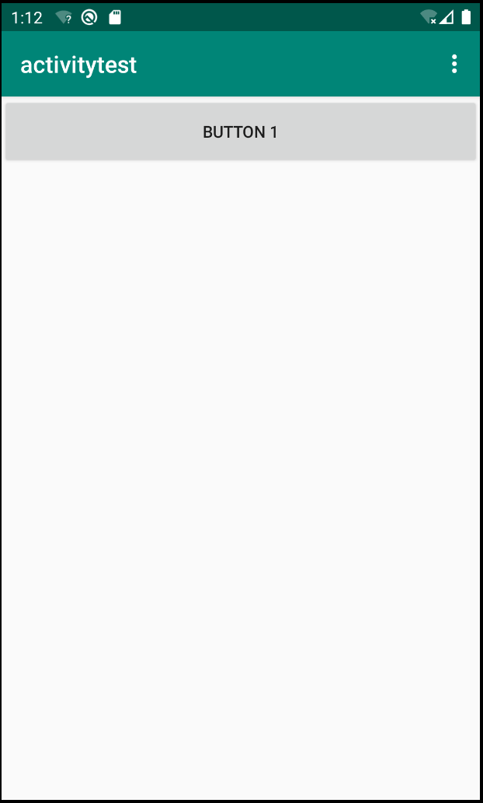
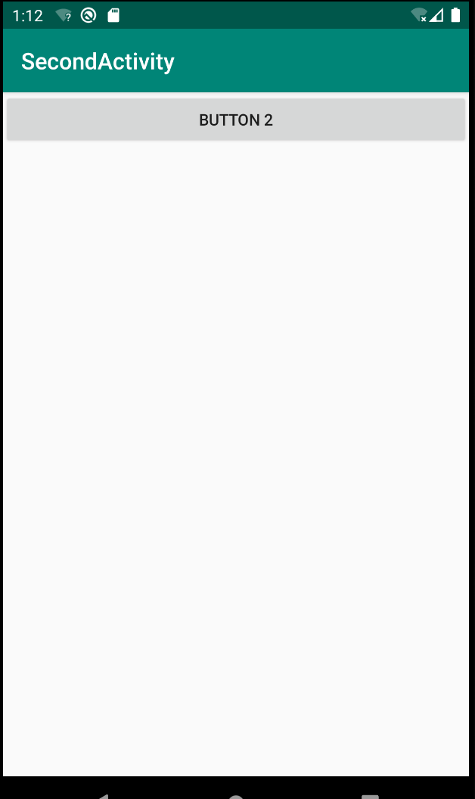
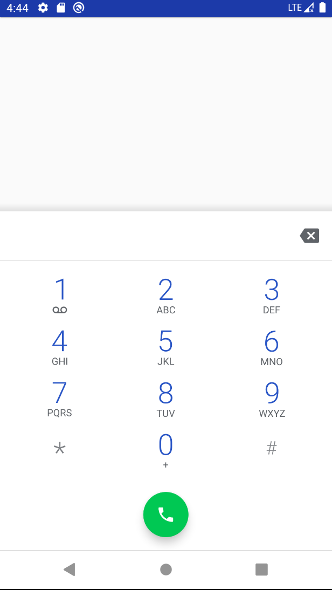
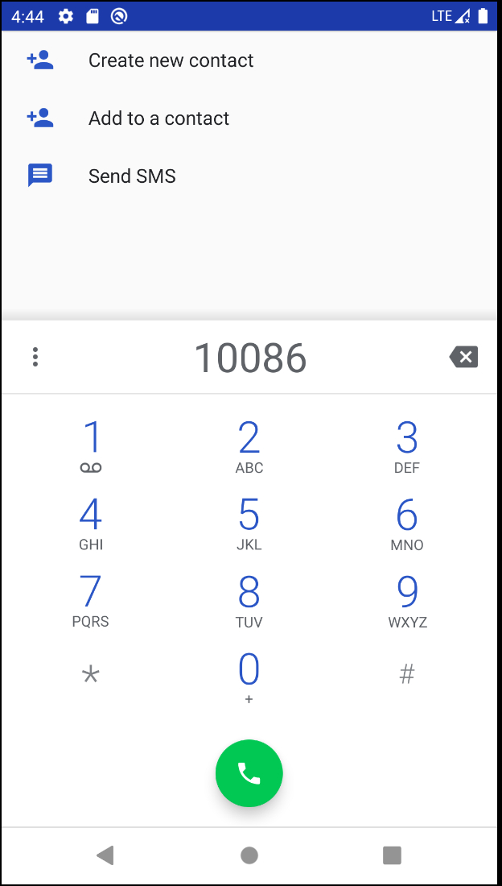

# Intent

前面知道如何常见一个活动，对于一个应用来说，只有一个活动基本上是很少的, 那么假如创建多个，如何在活动与活动之间进行跳转尼?

    答案：Intent

应用默认只有一个启动程序，也就是在 ``AndroidManifest.xml`` 中进行配置的. 这其实很好理解, 如果一个应用活动都设置为启动程序,那应用到底呈现给用户?


## 使用 Intent

先来创建一个活动, SecondActivity

``` java

package com.example.activitytest;

import android.os.Bundle;
import androidx.appcompat.app.AppCompatActivity;

import android.view.View;
import android.widget.Button;

public class SecondActivity extends AppCompatActivity {

    @Override
    protected void onCreate(Bundle savedInstanceState) {
        super.onCreate(savedInstanceState);
        setContentView(R.layout.activity_second);

        Button button2 = (Button)  findViewById(R.id.button_2);
        button2.setOnClickListener(new View.OnClickListener() {
            @Override
            public void onClick(View v) {
                // finish();
            }
        });

    }

}


```

* 布局文件

``` xml
    <!--layout-->

    <?xml version="1.0" encoding="utf-8"?>
    <LinearLayout xmlns:android="http://schemas.android.com/apk/res/android"
        xmlns:app="http://schemas.android.com/apk/res-auto"
        xmlns:tools="http://schemas.android.com/tools"
        android:layout_width="match_parent"
        android:layout_height="match_parent"
        tools:context=".SecondActivity">

    <Button
        android:id="@+id/button_2"
        android:layout_width="match_parent"
        android:layout_height="wrap_content"
        android:text="Button 2"
        />
    </LinearLayout>

```

* 在主文件中注册活动:
``` xml

    <activity
        android:name=".SecondActivity"
        android:label="@string/title_activity_second"
        ></activity>

```

Intent 是Android中活动之间跳转的重要方式, 一般来说活动分为两种:  ``显式 Intent``、``隐式 Intent``

### 显式 Intent

先来看看如何构造 Intent, 下面所有构造 Intent 的方式.

``` java

     /**
     * Create an empty intent.
     */
    public Intent() {
    }

    /**
     * Copy constructor.
     */
    public Intent(Intent o) {
        this(o, COPY_MODE_ALL);
    }
    /**
     * Create an intent with a given action.  All other fields (data, type,
     * class) are null.  Note that the action <em>must</em> be in a
     * namespace because Intents are used globally in the system -- for
     * example the system VIEW action is android.intent.action.VIEW; an
     * application's custom action would be something like
     * com.google.app.myapp.CUSTOM_ACTION.
     *
     * @param action The Intent action, such as ACTION_VIEW.
     */
    public Intent(String action) {
        setAction(action);
    }

    /**
     * Create an intent with a given action and for a given data url.  Note
     * that the action <em>must</em> be in a namespace because Intents are
     * used globally in the system -- for example the system VIEW action is
     * android.intent.action.VIEW; an application's custom action would be
     * something like com.google.app.myapp.CUSTOM_ACTION.
     *
     * <p><em>Note: scheme and host name matching in the Android framework is
     * case-sensitive, unlike the formal RFC.  As a result,
     * you should always ensure that you write your Uri with these elements
     * using lower case letters, and normalize any Uris you receive from
     * outside of Android to ensure the scheme and host is lower case.</em></p>
     *
     * @param action The Intent action, such as ACTION_VIEW.
     * @param uri The Intent data URI.
     */
    public Intent(String action, Uri uri) {
    }

    /**
     * Create an intent for a specific component.  All other fields (action, data,
     * type, class) are null, though they can be modified later with explicit
     * calls.  This provides a convenient way to create an intent that is
     * intended to execute a hard-coded class name, rather than relying on the
     * system to find an appropriate class for you; see {@link #setComponent}
     * for more information on the repercussions of this.
     *
     * @param packageContext A Context of the application package implementing
     * this class.
     * @param cls The component class that is to be used for the intent.
     *
     * @see #setClass
     * @see #setComponent
     * @see #Intent(String, android.net.Uri , Context, Class)
     */
    public Intent(Context packageContext, Class<?> cls) {
    }

    /**
     * Create an intent for a specific component with a specified action and data.
     * This is equivalent to using {@link #Intent(String, android.net.Uri)} to
     * construct the Intent and then calling {@link #setClass} to set its
     * class.
     *
     * <p><em>Note: scheme and host name matching in the Android framework is
     * case-sensitive, unlike the formal RFC.  As a result,
     * you should always ensure that you write your Uri with these elements
     * using lower case letters, and normalize any Uris you receive from
     * outside of Android to ensure the scheme and host is lower case.</em></p>
     *
     * @param action The Intent action, such as ACTION_VIEW.
     * @param uri The Intent data URI.
     * @param packageContext A Context of the application package implementing
     * this class.
     * @param cls The component class that is to be used for the intent.
     *
     * @see #Intent(String, android.net.Uri)
     * @see #Intent(Context, Class)
     * @see #setClass
     * @see #setComponent
     */
    public Intent(String action, Uri uri,
            Context packageContext, Class<?> cls) {
    }

```

先来了解 `` public Intent(Context packageContext, Class<?> cls) `` 方式, 第一个参数就是 ``当前上下文`` , 第二个参数 ``cls`` 指定跳转到那个 Activity.

跳转 **Activity** 大概步骤：

* 指定跳转的 Activity
* 通过当前 Activity 提供的 startActivity(Indent) 启动跳转

下面来看看实际代码:

``` java

    final Intent intent = new Intent(FristActivity.this, com.example.activitytest.SecondActivity.class);
    Button button1 = (Button)  findViewById(R.id.button_1);
    button1.setOnClickListener(new View.OnClickListener() {
        @Override
        public void onClick(View v) {
            startActivity(intent);
        }
    });

```
通过点击按钮后,可以看到跳转到 ``SecondActivity`` 页面.





这种很直观看出 Indent的 ``意图``,  我们想要跳转到那, 所以把这种方式称之为 ``显示Indent``.

### 隐式 Intent

相比显示 Indent , 隐式 Intent 就含蓄多了, 它并不会明确指定跳转到哪，而是指定一系列抽象的 ``action``,``category`` 等信息. 然后交由系统去判断具体跳转到那个 Activity.

``` xml

    <activity
        android:name=".SecondActivity"
        android:label="@string/title_activity_second"
        >
        <intent-filter>
            <action android:name="android.intent.ACTION_START"/>
            <category android:name="android.intent.category.DEFAULT"/>
        </intent-filter>
    </activity>

```

``itent-filter `` 可以理解为过滤条件， 只有 action为 ``android.intent.ACTION_START``的 intent 且 category 为 ``android.intent.category.DEFAULT`` 的 Indent 才会被匹配.

下面来看看具体代码:

``` java

final Intent intent = new Intent("android.intent.ACTION_START");
Button button1 = (Button)  findViewById(R.id.button_1);
button1.setOnClickListener(new View.OnClickListener() {
    @Override
    public void onClick(View v) {
        startActivity(intent);
    }
});

```

指定 action ，就可以跳转了, 细心你肯定会有疑问, 不是说只有同时 action（行为） 和 category（类目）同时匹配才能跳转么. 没错 只不过默认情况下 intent 默认为 “android.intent.category.DEFAULT”, 下面我们可以测试假如我们指定一个其它的类目看看是否能够正常跳转

``` java

final Intent intent = new Intent("android.intent.ACTION_START");
intent.addCategory("com.example.activitytest.MY_CATEGORY");
Button button1 = (Button)  findViewById(R.id.button_1);
button1.setOnClickListener(new View.OnClickListener() {
    @Override
    public void onClick(View v) {
        startActivity(intent);
    }
});

```
尝试再次点击按钮、 boom 💥程序直接奔溃啦~  也就是没有匹配到具体的 indent .

``` log

    2019-11-24 08:16:58.165 25658-25658/com.example.activitytest E/AndroidRuntime: FATAL EXCEPTION: main
    Process: com.example.activitytest, PID: 25658
    android.content.ActivityNotFoundException: No Activity found to handle Intent { act=android.intent.ACTION_START cat=[com.example.activitytest.MY_CATEGORY] }
        at android.app.Instrumentation.checkStartActivityResult(Instrumentation.java:2051)
        at android.app.Instrumentation.execStartActivity(Instrumentation.java:1709)
        at android.app.Activity.startActivityForResult(Activity.java:5192)
        at androidx.fragment.app.FragmentActivity.startActivityForResult(FragmentActivity.java:676)
        at android.app.Activity.startActivityForResult(Activity.java:5150)
        at androidx.fragment.app.FragmentActivity.startActivityForResult(FragmentActivity.java:663)
        at android.app.Activity.startActivity(Activity.java:5521)
        at android.app.Activity.startActivity(Activity.java:5489)
        at com.example.activitytest.FristActivity$1.onClick(FristActivity.java:49)
        at android.view.View.performClick(View.java:7125)
        at android.view.View.performClickInternal(View.java:7102)
        at android.view.View.access$3500(View.java:801)
        at android.view.View$PerformClick.run(View.java:27336)
        at android.os.Handler.handleCallback(Handler.java:883)
        at android.os.Handler.dispatchMessage(Handler.java:100)
        at android.os.Looper.loop(Looper.java:214)
        at android.app.ActivityThread.main(ActivityThread.java:7356)
        at java.lang.reflect.Method.invoke(Native Method)
        at com.android.internal.os.RuntimeInit$MethodAndArgsCaller.run(RuntimeInit.java:492)
        at com.android.internal.os.ZygoteInit.main(ZygoteInit.java:930)
```

如何让程序正确运行，只需要去 ``indent-filter`` 中去指定 category 为 “com.example.activitytest.MY_CATEGORY”.

``` xml

   <activity
        android:name=".SecondActivity"
        android:label="@string/title_activity_second"
        >
        <intent-filter>
            <action android:name="android.intent.ACTION_START"/>
            <category android:name="android.intent.category.DEFAULT"/>
            <category android:name="com.example.activitytest.MY_CATEGORY"/>
        </intent-filter>
    </activity>

```

又恢复正常，虚惊一场啦.

**注意**

> category action 属性值是可以自定定义的,尽量以某种固定格式，通过是包名+ actionName , categoryName

显式和隐式可以这么理解, 前者可以为静态的方式、后者认为动态的.

### 更多隐式 Intent 的用法

实际上隐式 Indent 还有更多的内容需要你去了解，我们继续介绍一下

使用 隐式 Intent， 我们不仅可以启动自己程序内的活动， 还可以启动其它程序的活动，这使得 Android 多个应用之间的功能共享成为可能. 比如说你的应用程序中需要展示一个网页，这是你没有必要自己去实现一个浏览器（事实上也不太可能完成），而只需要调用系统的浏览器来打开这个网页就行了.

``` java

final Intent intent = new Intent(Intent.ACTION_VIEW);
intent.setData(Uri.parse("https://www.baidu.com"));
Button button1 = (Button)  findViewById(R.id.button_1);
button1.setOnClickListener(new View.OnClickListener() {
    @Override
    public void onClick(View v) {
        startActivity(intent);
    }
});

```


这里首先指定了 Indent 的 ``action`` 是 ``Intent.ACTION_VIEW``, 这是 android 系统内置的动作，其常量值为 android.intent.action.VIEW.  然后你通过 Uri.parse() 将一个网址字符串解析成一个 Uri 对象，再调用Intent的 ``setData`` 方法将这个 ``Uri`` 对象传递进去.

具体传递什么参数,跟调用的 Action 有关.

与此对应的, 我们可以在 intent-filter 标签中再配置一个 <data>标签, 用于更精确地指定当前活动能够响应什么类型的数据. <data>标签中主要可以配置以下内容.

* android:scheme 指定数据的协议部分. 如 http、 https、 scheme url
* android:host 用于指定数据的主机名部分，如上例中的 www.baidu.com部分。
* android:port 用于指定数据的端口部分,一般紧随在主机名之后
* android:path 用于指定主机名和端口之后的部分，如一段网址中跟在域名之后的内容
* android:mimeType 用于指定可以出的数据类型，允许使用通配符的方式进行指定.

只有<data>标签中指定的内容和``Indent``中携带的 ``Data`` 完全一致时, 当前活动才能够响应该 ``Intent``. 不过一般在 <data>标签中不会指定过多的内容，如上面浏览器示例中，其实只需要指定 android:scheme为http,就可以响应所有http协议的``Intent``了.

下面我们可以自己定义一个 Activity 来响应打开网页的 ``Indent`` .

``` xml

    <activity android:name=".ThirdActivity">
        <intent-filter>
            <action android:name="android.intent.ACTION_VIEW"></action>
            <category android:name="android.intent.category.DEFAULT" />
            <category android:name="android.intent.category.BROWSABLE"/>
            <data  android:scheme="https" />
        </intent-filter>
    </activity>

```

除来打开 http 类协议外，还可以打开其它的协议 例如：``geo`` 地理位置、``tel`` 表示打电话. 下面我们来看看拨打电话的示例：

``` java

    final Intent intent = new Intent(Intent.ACTION_DIAL);
    intent.setData(Uri.parse("tel:10086"));
    Button button1 = (Button)  findViewById(R.id.button_1);
    button1.setOnClickListener(new View.OnClickListener() {
        @Override
        public void onClick(View v) {
            startActivity(intent);
        }
    });

```

具体 ``Intent.ACTION_DIAL`` 表示一个固定 action,

``` comment

    /**
     * Activity Action: Dial a number as specified by the data.  This shows a
     * UI with the number being dialed, allowing the user to explicitly
     * initiate the call.
     * <p>Input: If nothing, an empty dialer is started; else {@link #getData}
     * is URI of a phone number to be dialed or a tel: URI of an explicit phone
     * number.
     * <p>Output: nothing.
     */

```

传递数据为拨打的号码, 展示的UI界面是拨打电话的界面. 允许用户指定初始化的拨打的电话.
如果不输入默认显示一个拨打电话界面

否则就是显示传入的电话.


