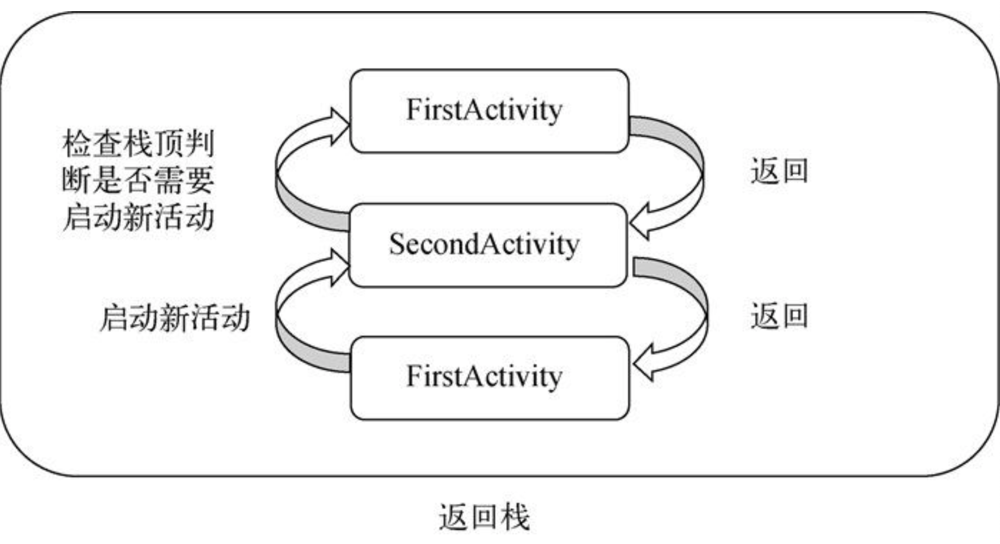
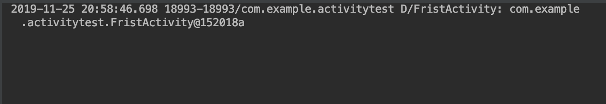
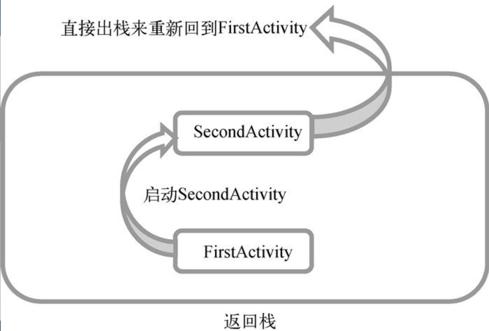
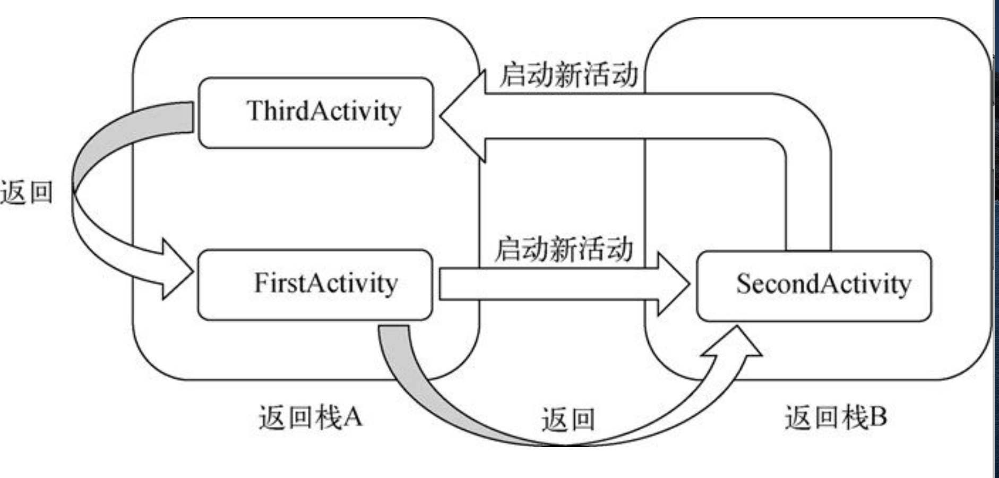

# 活动启动模式

启动模式主要分为 4 种, 分别是 标准启动模式（standard）、singleTop、singleTask、singleInstance, 可以在 AndroidManifast.xml 中通过 ``android:launchMode`` 进行指定 Activity 的启动方式.

## standard （默认的启动方式）

*   默认情况，也就是没显示指定启动模式的情况下，活动都是已标准的方式启动
*   Android是通过``返回栈``来管理活动的，在standard模式下，每当启动一个新的活动就会加入到``返回栈``的顶部，对于使用 standard模式的活动，系统并不会在乎启这个活动是否在返回栈中，每次启动都会创建一个新的实例.

下面可以通过实例来看看

* 1 在 FristActivity 中修改代码如下

``` java

    @Override
    protected void onCreate(Bundle savedInstanceState) {
        super.onCreate(savedInstanceState);
        setContentView(R.layout.frist_layout);
        // 打印对象字符串形式
        Log.d("FristActivity", this.toString());

        Button button1 = (Button)  findViewById(R.id.button_1);
        button1.setOnClickListener(new View.OnClickListener() {
            @Override
            public void onClick(View v) {
                final Intent intent = new Intent(FristActivity.this, FristActivity.class);
                startActivity(intent);
            }
        });
```

* 2 连续点击界面上的 ``Button1`` 按钮
* 3 控制台输入内容如下


可以看到点击多少次,打印出得对象都不一样. 也就说明每启动一次，都会创建一个新的实例.

standard模式的示意图:


## singleTop

*   当启动的活动已处于栈顶, 那么系统不会再新创建实例,而是会直接复用.

*   如果不在栈顶，即使启动的活动已存在栈中依然还是会创建新的实例

👇通过实例来看看

* 1 在 AndrodMainfest.xml 中修改 FristActivity 的启动模式

``` xml

    <activity
        android:name=".FristActivity"
        android:launchMode="singleTop"
        android:label="@string/app_name">
        <intent-filter>
            <!-- 行为 -->
            <action android:name="android.intent.action.MAIN" />
            <!-- 类目 -->
            <category android:name="android.intent.category.LAUNCHER" />
        </intent-filter>
    </activity>

```

* 2 连续点击界面上的 ``Button1`` 按钮
* 3 控制台输入内容如下


从打印输入的结果来看，并没有重复打印.

👇再修改下实例我们来看看，当存在栈中但不处于栈顶时，还会不会再创建一个实例.

* 1 同时修改下 ``FristActivity``, ``SecondActivity`` 中的 onCreated 方法, 如下

``` java
    // FristActivity
    @Override
    protected void onCreate(Bundle savedInstanceState) {
        super.onCreate(savedInstanceState);
        // 指定布局文件
        // 项目中添加的任何资源文件都会在 R 文件中.
        setContentView(R.layout.frist_layout);
        Log.d("FristActivity", this.toString());
        Button button1 = (Button)  findViewById(R.id.button_1);
        button1.setOnClickListener(new View.OnClickListener() {
            @Override
            public void onClick(View v) {

                /**
                    * 1 启动活动方式 startActivityForResult(Intent, Bound)  第一个启动哪个Intent， 第二个是请求码主要用与返回结果的回调中判断返回的来源
                    * 2 重写 onActivityResult 接收返回值
                    */

                final Intent intent = new Intent(FristActivity.this, SecondActivity.class);
                startActivity(intent);
            }
        });
    }

```

``` java
    // SecondActivity

    Button button1 = (Button)  findViewById(R.id.button_1);
    button1.setOnClickListener(new View.OnClickListener() {
        @Override
        public void onClick(View v) {

            /**
                * 1 启动活动方式 startActivityForResult(Intent, Bound)  第一个启动哪个Intent， 第二个是请求码主要用与返回结果的回调中判断返回的来源
                * 2 重写 onActivityResult 接收返回值
                */

            final Intent intent = new Intent(FristActivity.this, FristActivity.class);
            startActivity(intent);
        }
    });

```

* 重启应用，先点击 ``Button 1`` 再点击 ``Button 2``
* 控制台输出结果


singleTop模式的原理示意图：




## singleTask

前面 ``singleTop`` 只有当活动处于栈顶时可以被复用，那么有没有一种方式只要当前活动处于栈中就可以被复用? ``singleTask``.

### singleTask 工作流程

当活动启动模式是 ``singleTask``时，每次启动该活动时都会去``返回栈``中先查找，找到就直接使用该实例，并把在这个活动上面的所有活动统统出栈，如果没有找到就重新创建一个.

👇我们通过代码直观了解下, 在原来基础上修改下 FristActivity 启动方式.

* 1 修改 AndroidManifest.xml 文件
``` xml

<activity
    android:name=".FristActivity"
    android:launchMode="singleTask"
    android:label="@string/app_name">
    <intent-filter>

        <!-- 行为 -->
        <action android:name="android.intent.action.MAIN" />
        <!-- 类目 -->
        <category android:name="android.intent.category.LAUNCHER" />
    </intent-filter>
 </activity>

```
* 2 修改 SecondActivity, 观察下是否会执行 onDestory()方法（出栈）

``` java

   @Override
    protected void onDestroy() {
        super.onDestroy();
        Log.d("SecondeActivity", "onDestroy");
    }

```

* 3 重新启动应用
* 4 点击 Button1 -> SecondActivity -> Button2
* 5 控制台输出结果如下：




``singleTask`` 大概流程图如下：




## singleInstance

这种应该这四种中最特殊同时也是最复杂的一个.  当遇到``singleInstance``活动时， 系统会启动一个新的``返回栈``来管理这个活动.

那么这样做有什么意义?

假设我们的应用程序中有一个活动是允许``其它程序``调用的，如果我们想实现其它程序和我们的程序可以共享这个活动的实例，应该如何实现呢? 使用前面三种启动模式肯定是做不到的，因为每个应用程序都有自己的返回栈，同一个活动在不同的返回栈中肯定会新创建一个实例. 而使用 ``singleInstance`` 正好可以解决这个问题，在这种模式下单独有一个``返回栈``来管理,不管那个程序来访问都会返回同一个实例.

那么怎么测试下上面描述是否正确🙆？ 可以通过查看 taskId 来得到答案(前面说到过，通过任务方式来管理活动栈的).

👇 通过下面一个实例来熟悉下：

* 1 修改下 ``AndriodManifest.xml`` , 把 SecondeActivity 启动方式改为 ``singleInstance``

``` xml

    <activity
        android:name=".SecondActivity"
        android:launchMode="singleInstance"
        android:label="@string/title_activity_second">
        <intent-filter>
            <action android:name="android.intent.ACTION_START" />

            <category android:name="android.intent.category.DEFAULT" />
            <category android:name="com.example.activitytest.MY_CATEGORY" />
        </intent-filter>
    </activity>

```
* 2 在 FristActivity、SecodeActivity、ThirdActivity 中的 ``onCreate()`` 打印 taskId 值.

``` java

 Log.d("FristActivity", "This is TaskId: " + getTaskId());
 Log.d("SecondActivity", "This is TaskId: " + getTaskId());
 Log.d("ThirdActivity", "This is TaskId: " + getTaskId());

```
* 3 重新启动应用程序
* 4 FristActivity 中点击 Button1 -> SecondActivity 点击 Button2 -> ThirdActivity
* 5 控制台输出日志

``` log

2019-11-25 21:46:15.445 20866-20866/com.example.activitytest D/FristActivity: This is TaskId: 94
2019-11-25 21:46:33.754 20866-20866/com.example.activitytest D/SecondActivity: This is TaskId: 95
2019-11-25 21:46:38.414 20866-20866/com.example.activitytest D/ThirdActivity: This is TaskId: 94

```

可以直观看出来, ``SecondeActivity`` taskId 是不一样,也说明它处在不同的返回栈中.


下面还有一个地方注意， 当我们按 ``Back`` 键时，返回流程是这样：

> ThirdActivity -> FristActivity -> SecondActivity

为什么会是这样?

因为 ThirdActivity 和 FristActivity 是在同一个栈中，当 ThirdActivity 出栈,那么 FristActivity 就到来栈顶位置, 当再按一下 ``Back`` 键时前一个返回栈空了, 进入下一个返回栈 ``SecondActivity`` 呈现给用户，再按一下 ``Back`` 程序退出.

``singleInstance`` 大概流程如下图：




