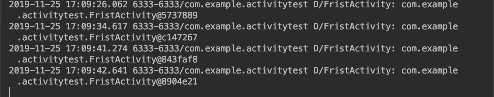
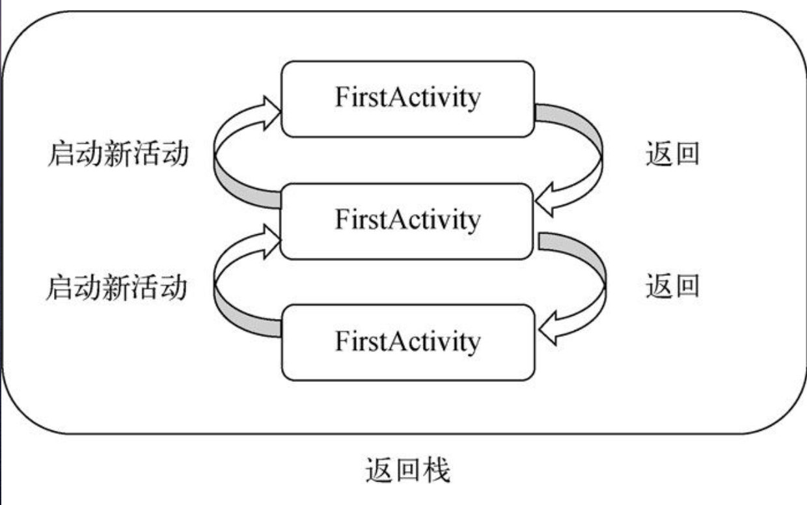
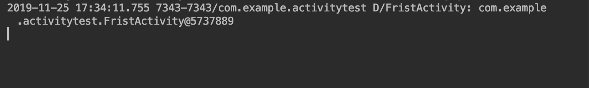
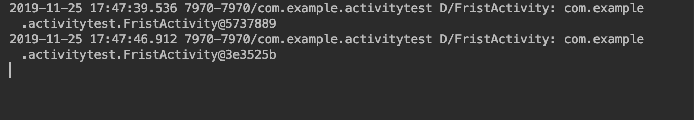

# 活动启动模式

启动模式主要分为 4 种, 分别是 标准启动模式（standard）、singleTop、singleTask、singleInstance, 可以在 AndroidManifast.xml 中通过 ``android:launchMode`` 进行指定 Activity 的启动方式.

## standard （默认的启动方式）

*   默认情况，也就是没显示指定启动模式的情况下，活动都是已标准的方式启动
*   Android是通过``返回栈``来管理活动的，在standard模式下，每当启动一个新的活动就会加入到``返回栈``的顶部，对于使用 standard模式的活动，系统并不会在乎启这个活动是否在返回栈中，每次启动都会创建一个新的实例.

下面可以通过实例来看看

* 1 在 FristActivity 中修改代码如下

``` java

    @Override
    protected void onCreate(Bundle savedInstanceState) {
        super.onCreate(savedInstanceState);
        setContentView(R.layout.frist_layout);
        // 打印对象字符串形式
        Log.d("FristActivity", this.toString());

        Button button1 = (Button)  findViewById(R.id.button_1);
        button1.setOnClickListener(new View.OnClickListener() {
            @Override
            public void onClick(View v) {
                final Intent intent = new Intent(FristActivity.this, FristActivity.class);
                startActivity(intent);
            }
        });
```

* 2 连续点击界面上的 ``Button1`` 按钮
* 3 控制台输入内容如下



可以看到点击多少次,打印出得对象都不一样. 也就说明每启动一次，都会创建一个新的实例.

standard模式的示意图:



## singleTop

*   当启动的活动已处于栈顶, 那么系统不会再新创建实例,而是会直接复用.

*   如果不在栈顶，即使启动的活动已存在栈中依然还是会创建新的实例

👇通过实例来看看

* 1 在 AndrodMainfest.xml 中修改 FristActivity 的启动模式

``` xml

    <activity
        android:name=".FristActivity"
        android:launchMode="singleTop"
        android:label="@string/app_name">
        <intent-filter>
            <!-- 行为 -->
            <action android:name="android.intent.action.MAIN" />
            <!-- 类目 -->
            <category android:name="android.intent.category.LAUNCHER" />
        </intent-filter>
    </activity>

```

* 2 连续点击界面上的 ``Button1`` 按钮
* 3 控制台输入内容如下



从打印输入的结果来看，并没有重复打印.

👇再修改下实例我们来看看，当存在栈中但不处于栈顶时，还会不会再创建一个实例.

* 1 同时修改下 ``FristActivity``, ``SecondActivity`` 中的 onCreated 方法, 如下

``` java
    // FristActivity
    @Override
    protected void onCreate(Bundle savedInstanceState) {
        super.onCreate(savedInstanceState);
        // 指定布局文件
        // 项目中添加的任何资源文件都会在 R 文件中.
        setContentView(R.layout.frist_layout);
        Log.d("FristActivity", this.toString());
        Button button1 = (Button)  findViewById(R.id.button_1);
        button1.setOnClickListener(new View.OnClickListener() {
            @Override
            public void onClick(View v) {

                /**
                    * 1 启动活动方式 startActivityForResult(Intent, Bound)  第一个启动哪个Intent， 第二个是请求码主要用与返回结果的回调中判断返回的来源
                    * 2 重写 onActivityResult 接收返回值
                    */

                final Intent intent = new Intent(FristActivity.this, SecondActivity.class);
                startActivity(intent);
            }
        });
    }

```

``` java
    // SecondActivity

    Button button1 = (Button)  findViewById(R.id.button_1);
    button1.setOnClickListener(new View.OnClickListener() {
        @Override
        public void onClick(View v) {

            /**
                * 1 启动活动方式 startActivityForResult(Intent, Bound)  第一个启动哪个Intent， 第二个是请求码主要用与返回结果的回调中判断返回的来源
                * 2 重写 onActivityResult 接收返回值
                */

            final Intent intent = new Intent(FristActivity.this, FristActivity.class);
            startActivity(intent);
        }
    });

```

* 重启应用，先点击 ``Button 1`` 再点击 ``Button 2``
* 控制台输出结果




## singleTask


## singleINstance