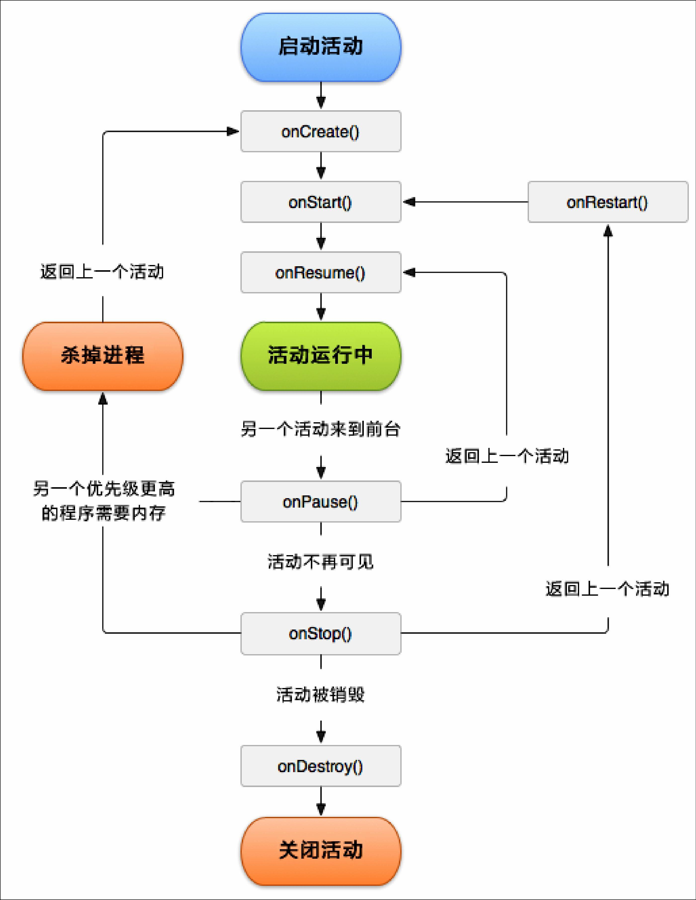

# 活动的生命周期

深入了解活动的生命周期对于我们写出流畅的程序是很有帮助, 因为每个生命周期的 hook 方法, 可以在活动不同状态的时候会被调用.
在了解生命周期时，我们先来了解几个概念.

## 返回栈

通过前面例子使用, 可以发现一个点, Android 中的活动是可以层叠的. 我们每启动一个新的活动, 就会覆盖在原来活动智商，然后点击 Back 键会销毁最上面的活动,下面的活动就会重新显示出来.

Android 本质是通过任务（Task）来管理活动的， 一个任务就是一组存放在栈里的活动的集合, 这个栈也被称作**返回栈(Back Stack)**.

那么这里又引入“栈”概念, 主要特性即可

> 后进先出 或 先进后出

默认情况下, 每当启动一个新的活动, 它会在返回栈中入栈，并处于栈顶的位置. 而每当我们按下 ``Back`` 键或调用 ``finish()`` 方法去销毁一个时，处于栈顶的活动会出栈,这时前一个入栈的活动就会重现处于栈顶的位置. 系统总是显示处于栈点的活动给用户.

大概流程如下图，所示:


## 活动状态

每个活动在其生命周期中最多可能会有4中状态.

* 运行状态

> 当一个活动位于返回栈的栈顶时，这时活动就处于运行状态. 系统最不愿意去回收这种活动，因为这样就会造成体验很差.

* 暂停状态

> 当一个活动不处于栈点, 但任然可见，这时活动就进入了暂停状态.  这是因为每个活动不一定铺满整个屏幕, 比如 对话框形式的活动只会占用屏幕中间的部分区域.  处于暂停状态的活动是存活的，系统同样也不愿意去回收.

* 停止状态
> 当一个活动不处于栈顶，并完全不可见时 🙅‍♂️, 这时活动就进入停止状态. 系统任然会为这种活动保存相应的状态和成员变量，但是这并不完全可靠的, 当其它地方需要内存时，处于停止状态的活动有可能被系统回收.

* 销毁状态

> 当一个活动从返回栈中移除后就变成了销毁状态. 系统会最倾向于回收处于这种状态的活动, 从而保证手机的内存足够.

## 活动的生存期

Activity 类中定义了 7 个回调方法，覆盖了活动生命周期的每一个环节，👇就来一一了解.

* onCreate() 创建
> 每个活动中我们都重写了这个方法，它会在活动第一次创建的时候调用. 一般在这个方法中完成活动的初始化操作，比如 加载布局，绑定事件等.
* onStart() 启动
> 这个方法在活动由不可见变为可见的时候调用.
* onResume() 恢复
> 这个方法在活动准备好和用户进行交互的时候调用. 此时活动一定位于返回栈的栈顶,并处于活动状态.
* onPause() 暂停
> 这个方法在系统准备去启动或恢复另一个活动的时候调用. 我们通常会在这个方法中将一些消耗CPU的资源释放掉，以及保存一些关键数据，但这个方法的执行速度一定要快，不然会影响到新栈顶活动的使用。
* onStop() 停止
> 这个方法在活动完全🙅‍♂️不可见的时候调用。 它与 onPause()主要区别在于，如果启动的新活动是一个对话框式的活动，那么 onPause()方法会得到执行，而 onStop()方法并不会执行。
* onDestroy() 销毁
> 这个方法在会懂销毁前调用，之后活动就变成了销毁状态
* onRestart() 重启
> 这个方法是在活动由停止状态变成运行状态之前调用，也就是活动被重新启动了。

细心肯定发现规律，除了 ``onRestart`` 之外，其它都是两两相对，从而又可以分为3中生存期

* 完整生成期

onCreate() -> onDestroy()

onCreate()进行资源加载，在onDestroy()中进行资源释放.

* 可见生存期

onCreate() -> onStrp() 方法之间所经历的，就是可见生存期. 在可见生存期内，活动对于用户总是可见的，即便有可能无法与用户进行交互。 我们可以通过这两个方法，合理的管理哪些对用户可见的资源。比如在 onCreate() 中对资源进行加载，而在 onStop() 方法中对资源进行释放，从而保证处于暂停状态的活动不会暂用太多的资源.

* 前台生存期
onResume() -> onPause() 活动在这两个之间所经历的就是前台生存期。在前台生存期内，活动总是处于运行状态，此时的活动是可以和用户交互的，我们平看到和接触最多的就是这个状态下的活动.

为了更好理解，我们来看看下面这个图，完整生命周期:




## 实战活动的生命周期

这里主要准备两个活动，一个对话框式的活动（DialogActivity），一个是正常的活动(NormalActivity)

**MainActivity.java**

``` java

package com.example.activitylifecycletest;

import android.content.Intent;
import android.nfc.Tag;
import android.os.Bundle;

import com.google.android.material.floatingactionbutton.FloatingActionButton;
import com.google.android.material.snackbar.Snackbar;

import androidx.appcompat.app.AppCompatActivity;
import androidx.appcompat.widget.Toolbar;

import android.util.Log;
import android.view.View;
import android.view.Menu;
import android.view.MenuItem;
import android.widget.Button;

public class MainActivity extends AppCompatActivity {

    @Override
    protected void onCreate(Bundle savedInstanceState) {
        super.onCreate(savedInstanceState);
        Log.d("Life", "onCreate");
        setContentView(R.layout.activity_main);
        Button startNomarlActivity = (Button) findViewById(R.id.button_1);
        Button startDialogActivity = (Button) findViewById(R.id.button_2);

        startNomarlActivity.setOnClickListener(new View.OnClickListener() {
            @Override
            public void onClick(View v) {
                Intent intent = new Intent(MainActivity.this, NormalActivity.class);
                startActivity(intent);
            }
        });
        startDialogActivity.setOnClickListener(new View.OnClickListener() {
            @Override
            public void onClick(View v) {
                Intent intent = new Intent(MainActivity.this, DialogActivity.class);
                startActivity(intent);
            }
        });
    }

    @Override
    protected void onStart() {
        super.onStart();
        Log.d("Life", "onStart");
        // The activity is about to become visible.
    }
    @Override
    protected void onResume() {
        super.onResume();
        // The activity has become visible (it is now "resumed").
        Log.d("Life", "onResume");
    }
    @Override
    protected void onPause() {
        super.onPause();
        // Another activity is taking focus (this activity is about to be "paused").
        Log.d("Life", "onPause");
    }
    @Override
    protected void onStop() {
        super.onStop();
        // The activity is no longer visible (it is now "stopped")
        Log.d("Life", "onStop");
    }
    @Override
    protected void onDestroy() {
        super.onDestroy();
        // The activity is about to be destroyed.
        Log.d("Life", "onDestroy");
    }

    @Override
    protected void onRestart() {
        super.onRestart();
        // The activity is about to be destroyed.
        Log.d("Life", "onRestart");
    }
}

```

**NormalActivity.java**

``` java

package com.example.activitylifecycletest;
import androidx.appcompat.app.AppCompatActivity;
import android.os.Bundle;

public class NormalActivity extends AppCompatActivity {

    @Override
    protected void onCreate(Bundle savedInstanceState) {
        super.onCreate(savedInstanceState);
        setContentView(R.layout.activity_normal);
    }
}

```

```xml

   <activity android:name=".NormalActivity"/>

```

**DialogActivity.java**

``` java

package com.example.activitylifecycletest;
import androidx.appcompat.app.AppCompatActivity;
import android.os.Bundle;

public class DialogActivity extends AppCompatActivity {

    @Override
    protected void onCreate(Bundle savedInstanceState) {
        super.onCreate(savedInstanceState);
        setContentView(R.layout.activity_dialog);
    }
}

```
通过指定 `` android:theme="@style/Theme.AppCompat.Dialog" ``,表示当前活动是对话框.

``` xml

  <activity android:name=".DialogActivity"  android:theme="@style/Theme.AppCompat.Dialog" ></activity>

```

从几个方面来体验生命周期:

* 启动 MainActivity

onCreate()、onStart()、onResume()

* 启动 NormalActivity

onPause()、onStop()

* 返回 MainActivity

onRestart()、onStart()、onPause()

* 启动 DialogActivity

onPause()

* 返回 DialogActivity

onResume()

* 退出应用程序

onPause()、onStop()、onDestroy()


## 活动被回收了怎么办

前面看生命周期时提及，当一个活动处于暂停⏸️，当系统内存不足的情况下有可能被回收。 那么想象一下一个常见：

引用中有一个活动 A, 用户在活动 A 的基础上启动了活动 B, 活动A就进入了停止状态，这个时候由于系统内存不足，将活动 A回收掉了， 然后用户按下 Back 键返回活动 A，会出现什么情况？

> 还是正常显示活动 A 的，只不过这时并不会执行 onRestart() 方法，而是会执行活动 A 的 onCreate() 方法，因为活动 A 在这种情况下会被重新创建一次.

如果遇到这种情况，会带来一个问题就是 A 页面状态丢失的问题，那么怎么来解决这个问题? 在 Activity 中提供了 ``onSaveInstanceState()`` 保护实例状态，这个方法在活动被回收时总会调用, onSaveInstanceState() 方法签名如下：

``` java

    @Override
    protected void onCreate(Bundle savedInstanceState) {
        super.onCreate(savedInstanceState);

        Log.d("Life", "onCreate");
        setContentView(R.layout.activity_main);

        if(savedInstanceState != null){
            String tempDate = savedInstanceState.getString("data_key");
            Log.d("savedInstanceState", tempDate);
        }
        ...
    }

    @Override
    protected void onSaveInstanceState(Bundle outState) {
        super.onSaveInstanceState(outState);
        String tempData = "需要保存的数据";
        outState.putString("data_key", tempData);
    }

```


