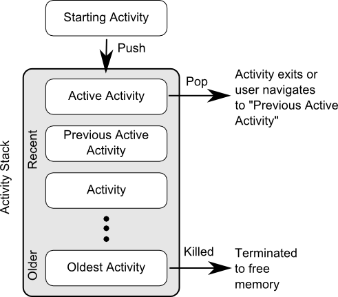

# 活动的生命周期

深入了解活动的生命周期对于我们写出流畅的程序是很有帮助, 因为每个生命周期的 hook 方法, 可以在活动不同状态的时候会被调用.
在了解生命周期时，我们先来了解几个概念.

## 返回栈

通过前面例子使用, 可以发现一个点, Android 中的活动是可以层叠的. 我们每启动一个新的活动, 就会覆盖在原来活动智商，然后点击 Back 键会销毁最上面的活动,下面的活动就会重新显示出来.

Android 本质是通过任务（Task）来管理活动的， 一个任务就是一组存放在栈里的活动的集合, 这个栈也被称作**返回栈(Back Stack)**.

那么这里又引入“栈”概念, 主要特性即可

> 后进先出 或 先进后出

默认情况下, 每当启动一个新的活动, 它会在返回栈中入栈，并处于栈顶的位置. 而每当我们按下 ``Back`` 键或调用 ``finish()`` 方法去销毁一个时，处于栈顶的活动会出栈,这时前一个入栈的活动就会重现处于栈顶的位置. 系统总是显示处于栈点的活动给用户.

大概流程如下图，所示:

## 活动状态

每个活动在其生命周期中最多可能会有4中状态.

* 运行状态

> 当一个活动位于返回栈的栈顶时，这时活动就处于运行状态. 系统最不愿意去回收这种活动，因为这样就会造成体验很差.

* 暂停状态

> 当一个活动不处于栈点, 但任然可见，这时活动就进入了暂停状态.  这是因为每个活动不一定铺满整个屏幕, 比如 对话框形式的活动只会占用屏幕中间的部分区域.  处于暂停状态的活动是存活的，系统同样也不愿意去回收.

* 停止状态
> 当一个活动不处于栈顶，并完全不可见时 🙅‍♂️, 这时活动就进入停止状态. 系统任然会为这种活动保存相应的状态和成员变量，但是这并不完全可靠的, 当其它地方需要内存时，处于停止状态的活动有可能被系统回收.

* 销毁状态

> 当一个活动从返回栈中移除后就变成了销毁状态. 系统会最倾向于回收处于这种状态的活动, 从而保证手机的内存足够.

## 活动的生存期

Activity 类中定义了 7 个回调方法，覆盖了活动生命周期的每一个环节，👇就来一一了解.

* onCreate()
* onStart()
* onResume()
* onPause()
* onStop()
* onDestroy()
* onRestart()

